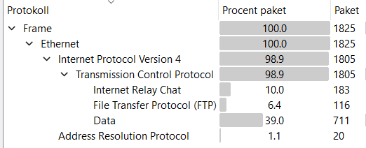
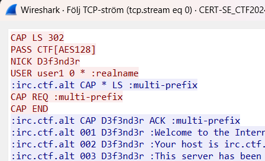
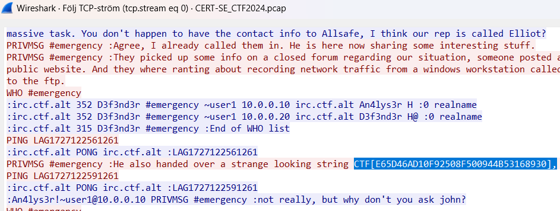

# CERT-SE-2024 CTF

This CTF was hosted by CERT-SE (MSB) in October 2024. It is available at the following link: https://www.cert.se/2024/09/cert-se-ctf2024.html.

From the description we have:

```
<scenario>
A fictional organisation has been affected by a ransomware attack. It has been successful in setting up an emergency channel for communication and has access to parts of its infrastructure.

Can you find all the flags?
</scenario>
```

There are a total of 9 flags, eight having the format "CTF[FLAG]" and one just in the format "[FLAG]", appending CTF gives you the full flag.

The following tools and programs was mainly used to complete the challenge:

- Wireshark / tshark
- Autopsy
- Cyberchef
- ...

## CERT-SE_CTF2024.pcap

Extracting the initial .zip file we are greated with a pcap file. We open this into wireshark to start analyzing it and looking for clues.

Going through the protocol hierarchy we can see that there appears the be an IRC conversation in place along with that files being transfered using FTP:

Lets start by looking over the IRC conversation for any interesting hints. By following the TCP-stream that corresponds to the IRC conversation we can easily examine the entire conversation.

From the IRC conversation we can conclude the following:

- Two users are in the #emergency chanel, that being An4lys3r! and D3f3nd3r.
- The ransomware note has been found on the infected system and sent over IRC as `RANSOM_NOTE.gz`.
- There was two `.pcap` files uploaded to the FTP server containing captured traffic from weeks / days before the attack happend.
- There is one disk file being discused that is also uploaded to the FTP server from one of their clients
- A wordlist was able to be recovered that was created by scraping their public website. It is also uploaded to the FTP server
- Two helping indicators for who was behind the attack was given.
  - First that traffic recorded from a windows workstation `CTF-PC01` was being discused on a closed forum.
  - Second, the ip-address `195.200.72.82` was involved in C2 and exfiltration activities

This gives us plenty of leads to follow and analyze. Before we continue, in the IRC conversation the first two flags can be found.

The first one can be found at the very start of the IRC conversations TCP-stream, that being `CTF[AES128]`:


Continuing down the conversation we can see a message discussing a "strange string" that their were handed by someone at allsafe. This is the second flag `CTF[E65D46AD10F92508F500944B53168930]`:

