# CERT-SE-2024 CTF

This CTF was hosted by CERT-SE (MSB) in October 2024. It is available at the following link: https://www.cert.se/2024/09/cert-se-ctf2024.html.

From the description we have:

```
<scenario>
A fictional organization has been affected by a ransomware attack. It has been successful in setting up an emergency channel for communication and has access to parts of its infrastructure.

Can you find all the flags?
</scenario>
```

There are a total of 9 flags, eight having the format "CTF[FLAG]" and one just in the format "[FLAG]", appending CTF gives you the full flag.

The following tools and programs was mainly used to complete the challenge:

- Wireshark / tshark
- Autopsy (not needed)
- Cyberchef
- Binwalk
- Hashcat

## CERT-SE_CTF2024.pcap

Extracting the initial .zip file we are greeted with a pcap file. We open this into wireshark to start analyzing it and looking for clues.

Going through the protocol hierarchy we can see that there appears the be an IRC conversation in place along with that files being transferred using FTP:


Lets start by looking over the IRC conversation for any interesting hints.

### IRC

By following the TCP-stream that corresponds to the IRC conversation we can easily examine the entire conversation.

From the IRC conversation we can conclude the following:

- Two users are in the #emergency chanel, that being An4lys3r! and D3f3nd3r.
- The ransomware note has been found on the infected system and sent over IRC as `RANSOM_NOTE.gz`.
- There was two `.pcap` files uploaded to the FTP server containing captured traffic from weeks / days before the attack happened.
- There is one disk file being disused that is also uploaded to the FTP server from one of their clients
- A wordlist was able to be recovered that was created by scraping their public website. It is also uploaded to the FTP server
- Two helping indicators for who was behind the attack was given.
  - First that traffic recorded from a windows workstation `CTF-PC01` was being discussed on a closed forum.
  - Second, the ip-address `195.200.72.82` was involved in C2 and exfiltration activities

This gives us plenty of leads to follow and analyze. Before we continue, in the IRC conversation the first two flags can be found.

The first one can be found at the very start of the IRC conversations TCP-stream, that being `CTF[AES128]`:


Continuing down the conversation we can see a message discussing a "strange string" that their were handed by someone at allsafe. This is the second flag `CTF[E65D46AD10F92508F500944B53168930]`:


With the two flags out of the way lets starts extracting the different files from the traffic.

We start of with the ransom note sent over IRC. To begin we find the packet were it began transferring in the IRC conversation, that being packet nr 157. Going a few packets down we can see a large amount of just pure TCP packets. By following this stream and viewing it in hex, we can see that the first hex characters, `1f 8b`, match the magic bytes for a gzip:

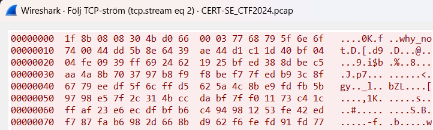

To save this, we simply show the data in the "RAW" format (binary) and save the file as `RANSOM_NOTE.gz`.

With that, we have gotten everything from the IRC conversation and can move on to analyze the FTP protocol.

### FTP

We know that at least 3-4 four files have been uploaded to a FTP server, so lets get them.

By following the TCP streams in Wireshark and incrementing through them we eventually get to the first one, displaying FTP commands:

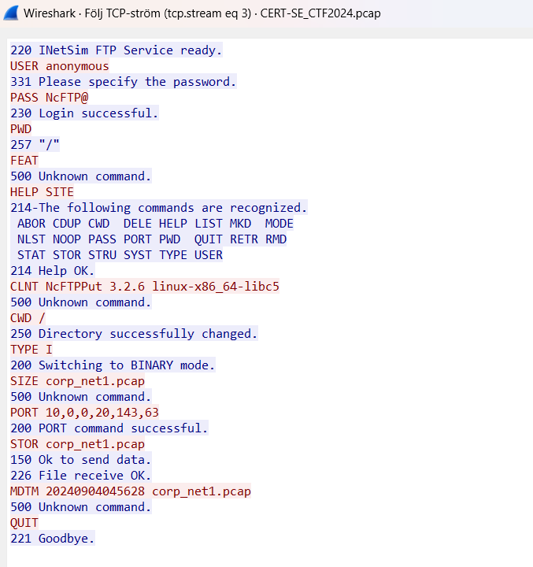

At the bottom of the stream we can see the name of the file being uploaded (in this case "corp_net1.pcap") and that it was successfully transferred. Looking at the next TCP stream (nr 4) in hex view, we can see that the first hex characters, `d4 c3`, matches that of the magic bytes of a .pcap files. This indicates that this is the file uploaded:

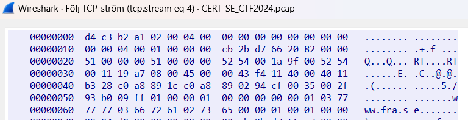

To extract it we do the same method as we did with the ransome note (view as RAW and save as with the corresponding extension).

Navigating through all the remaining TCP streams related to FTP and repeating the same method as show above we end up with the following files:

- corp_net1.pcap
- corp_net2.pcap
- disk.img.gz
- WORDLIST.txt

For clarities sake the WORDLIST.txt file contains strings in the following format `[STRING]`, the exact same as one of the flags:

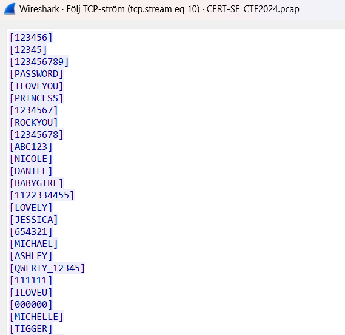

This is most likely going to be used in the future to get the correct flag from this file.

With that we have extracted everything of note and completed the analysis of the initial file. The remaining file can be tackled in any order.

## RANSOM_NOTE.gz

To start of we extract the archive to get the contents, inside we can find a single file named "why_not". Opening it in a text editor gives the following:

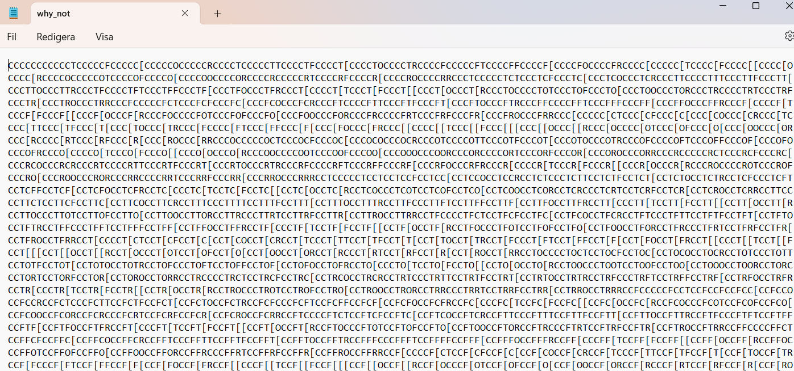

Quickly looking over it we can see a lot of the following character: "C", "T", "F", "O", "R" and "\["; further all these characters have the exact same number of occurrences. This is most likely an attempt to obfuscate the flag. Searching for "\]" in the files gives us 1 matched character! By either going backwards from this character until the format is correct OR removing all occurrences of characters except the first will give us our third flag, `CTF[OR]`:

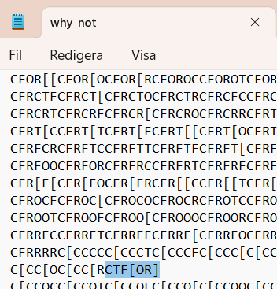

## disk.img.gz - Part 1

After extracting the .img file we open it in any analysis tool (or mount it). In this example "Autopsy" was used, mainly because I have used it before and had it ready.

After autopsy finishes analyzing the file we can look into the FAT32 file system extracted and note the following files:

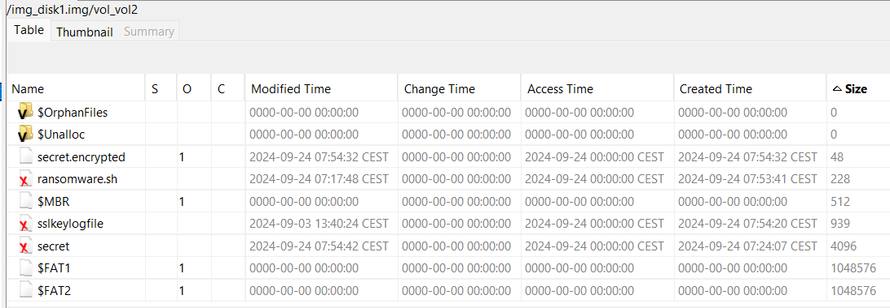

There are a couple out of the ordinary files here:

- secret.encrypted
- ranswomare.sh
- secret
- sslkeylogfile

Lets start by looking at the `ransomware.sh` file that has been deleted.

### Ransomware.sh

Opening it in autopsy we can see a short bash script that appears to have been executed:

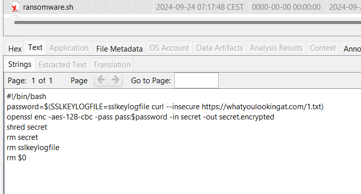

Lets do a quick walkthrough of what it does:

- Starts by declaring the `password` variable
- Sets the content of the local variable `SSLKEYLOGFILE` to the content of the file `sslkeylogfile`
- Sets the password variable to the content of the `https://whatyoulookingat.com/1.txt` file from the cURL request.
- Encrypts the `secret`files using AES-128-CBC with the password gotten from the previous step and saves it to `secret.encrypted`.
- Finally it overwrites the original `secret`file, before deleting it along with `sslkeylogfile` and finally itself.

Looking at the `secret` file we can see that it has %100 been overwritten, and there is no way to recover it in the given time frame. Therefore we need to decrypt the encrypted version, using the correct password gotten from the web resource.

Finally the `sslkeylogfile` contains what seems to be valid SSL session keys. Most likely needed to use to decrypt SSL traffic in the future:

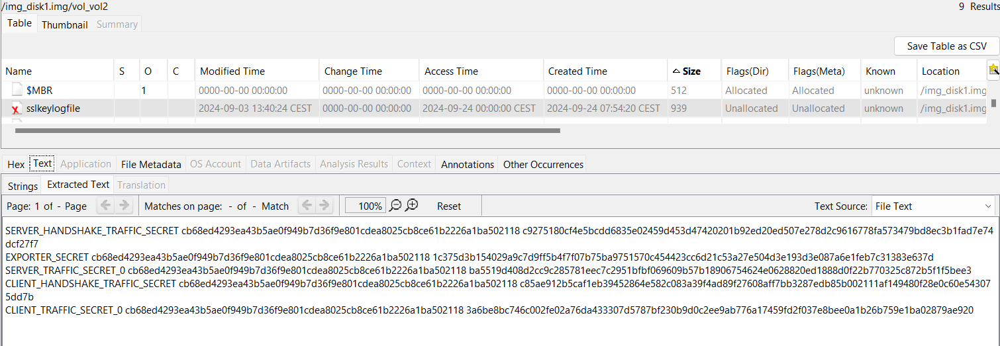

The two files we need for further analysis are `secret.encrypted` and `sslkeylogfile`, we extract them from the disk and keep them in mind.

Since there is nothing we can do unless we get the password we move on to the next file to analysis.

## corp_net1.pcap

Opening the file using wireshark we can see that the captured traffic is from 2024-09-03 & 2024-09-04. Looking over the protocol statistics we can see some interesting and of note protocols that are was used:

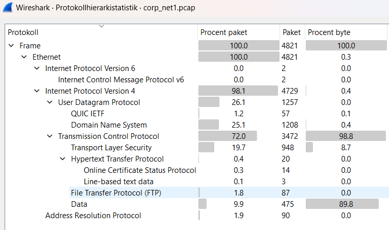

The following was noted:

- Once again we have `FTP` traffic, indicating that some files have been transferred.
- We can see `HTTP`traffic, along with `TLS` traffic, indicating that websites have been visited with both encrypted and unencrypted channels.
- A large amount of `DNS` lookups have been made.

To examine further we could also filter out the traffic, so only the packets related to the suspicious IP address (195.200.72.82) or the workstation (CTF-PC01).

### FTP

To start of we filter the data so we can get the first packet that is sent using FTP, it is also done from our suspicious IP. If we follow the TCP stream from that packet we can see that a file has been uploaded to the server named `puzzle.exe`:

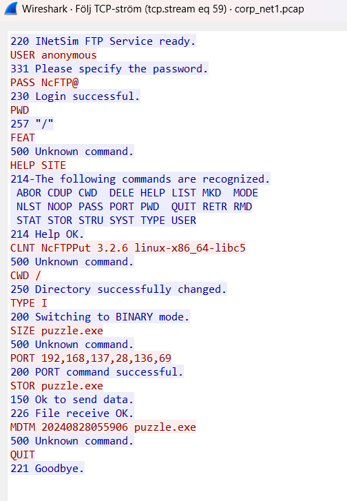

Looking at the following TCP stream and view it in hex view we can see the starting values, `4D 5A`, matches that of a DOS executable. Here we do the same technique with the first pcap file we analyzed (view as binary and save). Repeating this for all FTP uploads we get the following files:

- puzzle.exe
- Recycle-Bin.zip
- archive

We save these and will analyze them later.

### DNS

Filtering out the DNS traffic we see nothing out of the ordinary at the start, just usual and legit sites being visited. This is except one, `whatyoulookingat.com`, which we will get to in the next session. After a while we can see queries and responses containing the suspicious IP address,many looking "strange" and not being valid domains:

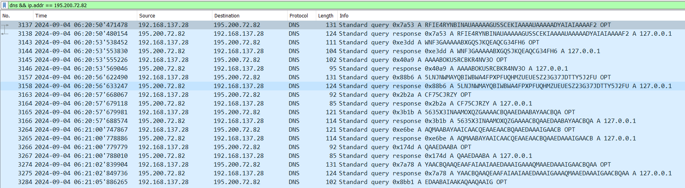

By analyzing the first query done of `RFIE4RYNBINAUAAAAAGUSSCEKIAAAAUAAAAADYAIAIAAAAF2` (using a encryption/decoding detection tool) we can see that it is being identified as "Base62" encoding. If we decode it we get the following:

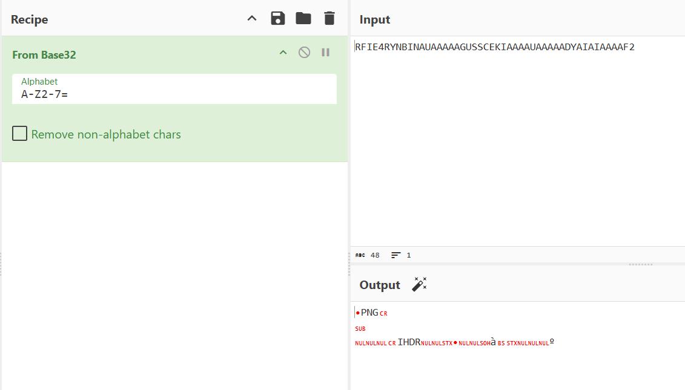

The "png" string returned indicates that this is the start of an image. Trying to render this gives nothing, meaning that we need the remaining parts of the image.

The full image is most likely a combination of all the DNS queries done by this IP, added together, base62 decoded and rendered. By using Tshark we can filter the traffic to only contain DNS, the IP 195.200.72.82 and to finally only print out the DNS name field:

```
tshark -r corp_net1.pcap -Y "ip.addr == 195.200.72.82 and dns" -T fields -e dns.qry.name
```

We save the output to a file, remove all the newlines, decoding and rendering it gives us the fourth flag `CTF[TOPPALUA]`:

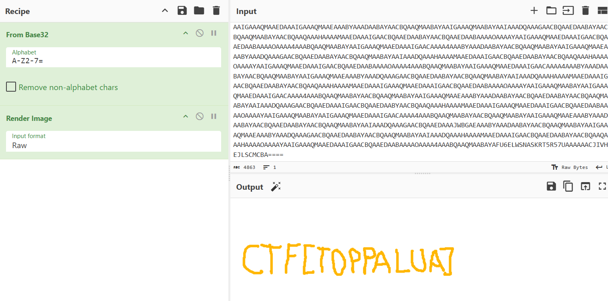

### HTTP / TLS traffic

Filtering out HTTP traffic does not yeild a lot.

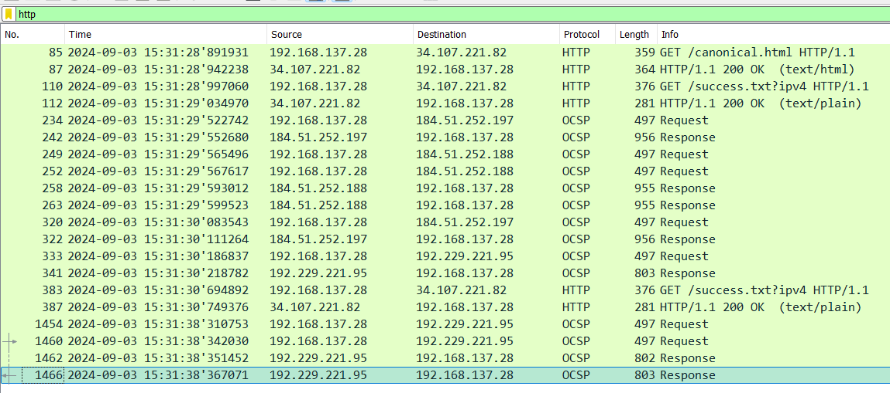

If we recall the information we got from `disk.img` that was present in the ransomware, we know a HTTP request (through cURL) was done to the domain `whatyoulookingat.com` with the SSL session keys that we have. Further the date of the current traffic also corresponds to that of the modification that of the `sslkeylogfile`.

If there was a HTTP request done, there is a high chance for a DNS lookup made to the domain. From looking at the DNS traffic in the previous section we saw that there had been mentions of the domain in the DNS records.

This confirms that the request done is most likely encrypted and we need to use the SSL session keys the decrypt the traffic. To do this we import the file in Wireshark (preferences -> protocols -> TLS) and reload. Once again we filter for HTTP and we can now see the request present in the ransomware:

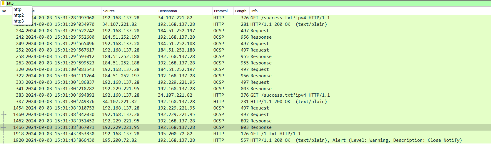

Looking at the response we see the following:

```http
HTTP/1.1 200 OK
Date: Tue, 03 Sep 2024 15:31:43 GMT
Content-Length: 17
Connection: Close
Server: INetSim HTTPs Server
Content-Type: text/plain

pheiph0Xeiz8OhNa
```

With that we have the password, "pheiph0Xeiz8OhNa" ,used to encrypt the `secret` file and can decrypt it.

## disk.img - Part 2

Back to `sceret.encryped` we no have the password and can decrypt it. Since we know from the ransomware that it was encrypted using OpenSSL we can decrypt it the same way with the following command:

```
openssl enc -aes-128-cbc -pass pass:pheiph0Xeiz8OhNa -in secret.encrypted -out secret.decrypted
```

Executing this in a terminal we get no warning of bad decrypt, indicating the password was correct and reading the output gives us our fifth flag `CTF[OPPORTUNISTICALLY]`:

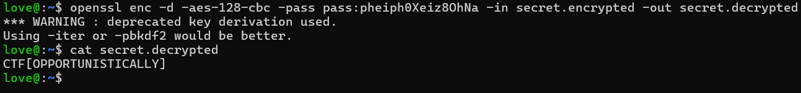

With this the disk is done and we can move on.

## corp_net2.pcap

Looking over this traffic capture we can see that it dates from earlier that the first one (2024-08-29) and contains less amount of packets in total. When viewing the protocol hierarchy we can see that it is mainly encrypted protocols, not good for us:

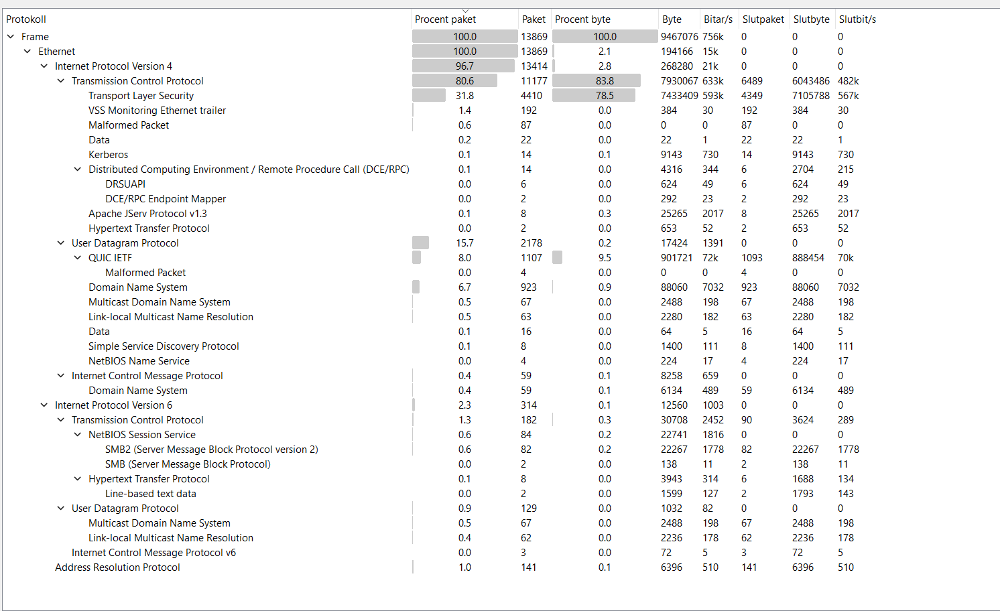

We have some interesting though that might be worth analyzing:

- HTTP
- SMB/SMB2
- Kerberos

Lets start with the HTTP traffic. We can see one GET request has been done and multiple "PROPFIND" request being done.

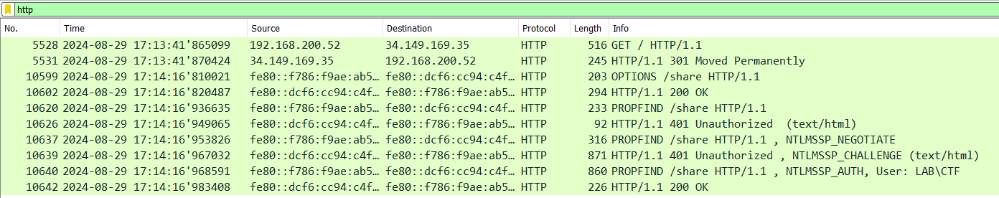

Further analysis of these request shows that these are authentication attempts to a WebDav share. The authentication method used is NTLMSSP. If we filter the traffic to match NTLMSSP we get the earlier mentioned SMB2 traffic:

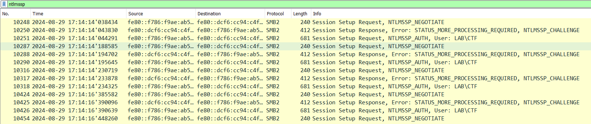

Here we can see multiple failed attempts to connect to the share using the "LAB\CTF" user. Since SMB2 can use NTLMv2 as authentication and we have all the necessary parts to reconstruct the hash, we could extract it and try to crack it.

You could manually recreate the hashes by analyzing the request and response, or use a CLI scripts (such as the [following](https://github.com/mlgualtieri/NTLMRawUnHide)) to extract them. In this case I went with NTLMRawUnHide script. Running the script on the file extracts multiple hashes:

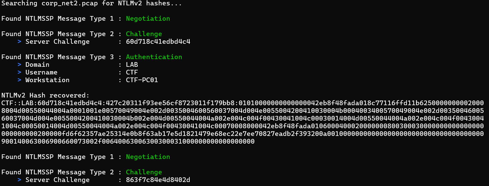

Do get this to a format suitable for cracking we run the following `python3 NTLMRawUnHide.py -i corp_net2.pcap -o hashes -q`, which saves the output to `hashes`.

Finally we can try to crack them using ex. hashcats. Since we got a wordlist (`WORDLIST.txt`) from the first step, lets first try running this list against them. After executing hashcat with the appropriate mode (5600), the hashes and the wordlist, we get that hashcat has successfully cracked the hash. Showing the result gives us or sixth flag by appending "CTF" to the password, `CTF[RHODE_ISLAND_Z]`:

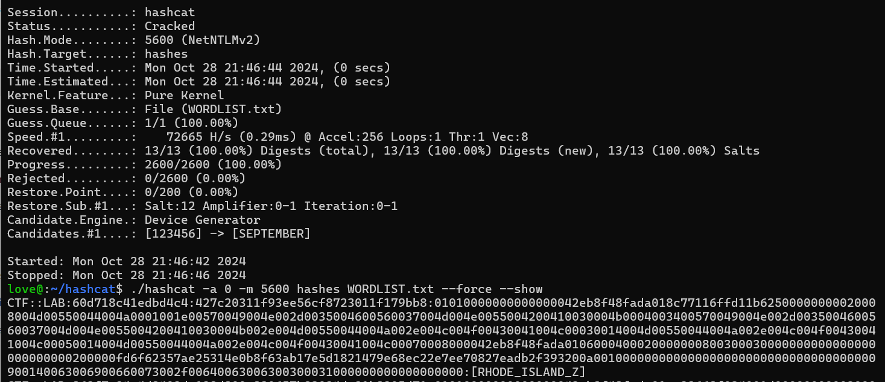

An alternative way of solving this found afterwards was extracting the kerberos credentials present through the use of ex. Networkminer. Afterwards this can be cracked, which results in the same flag:

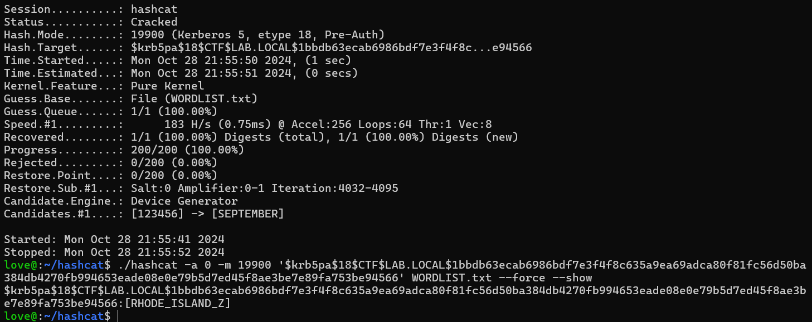

## archive

From `corp_net1.pcap` we acquired a file called `archive`. Because of the name lets try opening it using an archive program such as 7zip.

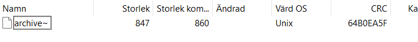

Inside it is another file, `archive~`. This is also an archive, interesting. Opening this file also contains a file, `archive~~`, which is yet another archive.

This repetition goes on for a while. In the archive tool we continue to navigate into the constantly new archives, after a while the file name changes to `input`. After a while we reach `input~~~~~~~~~~` which prompts us to open it with another program. Opening it using a text editor shows us the content and gives us the seventh flag, `CTF[IRRITATING]`:

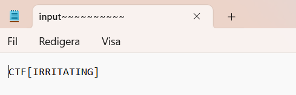

## Recycle-Bin.zip

Lets move on the next file gotten from `corp_net1.pcap`. We start of by unziping the file to extract its contents. Navigating further into the folders, we finally get to the user SID folder, that contains a bunch of deleted files:

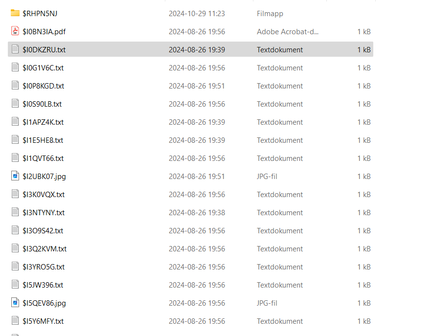

Many of the files are just 1 kB in size and contains the path to the original file as it content:

```
# Example
C:\Users\aleksej.pazjitnov\Documents\Min_Biografi_del_67.txt
```

Lets start by analyzing the files with actual content in them, these includes various PDFs, images, two archives and one executable. The executable when opened shows it being `HFS - HTTP File Server`, this is most likely a program used in helping with exfiltration and persistence on the attacked system.

Analyzing the images and PDFs using techniques such as binarywalking, extracting strings and steganography gives nothing. Meaning these files are most likely red hearings.

Further there are two archives present, `$RZ8ZSGB.zip` and `$RCXHUFJ.zip`, the latter being much larger in size than the former. Lets start by looking at the former, inside is a folder named `Bioagrafi` that contains a bunch of .txt files. All are named `Min_Biografi_del_XX.txt`, with XX being a number up till 69. Opening the first one gives us `Lorem`, and further analysis of the other parts shows that this is just the "Lorem Ipsum" phrase that has been split up.

Inside the other archive we find the following, a text file and executable:

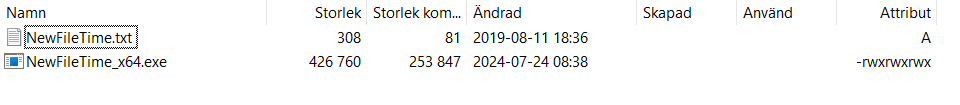

Opening the executable `NewFileTime_x64.exe` we can see that it is a shareware that lets you manipulate timestamps on files and folders:

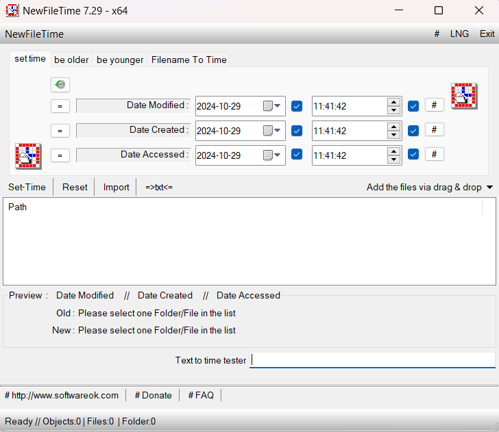

This has most likely been used as a "timestomping" tool, a technique were you hide your steps by modifying creation, accesses and modifications dates on files. Since we have nothing else to go on, lets look over the timestamps on the files in the archive.

Most of the files was last modified in August 2024, except two text files that stand out. These were last modified "1984-06-06". One of them contains the following content:

```
Jamborino Jamboro Archipelago Island Apple Horse
Monkey Dog
Kit Kat House Flower
```

This does not really give us anything, so lets open the second one:

```
C:\Users\aleksej.pazjitnov\Downloads\INKEMW2QIVHFIT2NJFHE6U25.txt
```

This is referencing the filepath of the deleted file, but there is something strange about the filename, `INKEMW2QIVHFIT2NJFHE6U25.txt`. Removing the file extension and analyzing the name shows us that is most likely base32 encoded. Decoding this gives us our eight flag `CTF[PENTOMINOS]`:

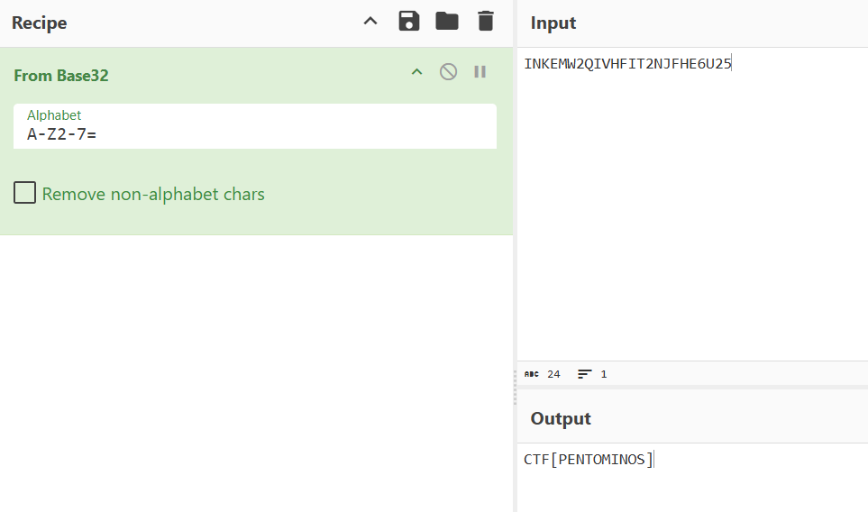

## puzzle.exe

We will start of by running the program to see what it is. It appears to be a puzzle that when solved will show an AI generated image that has been split:

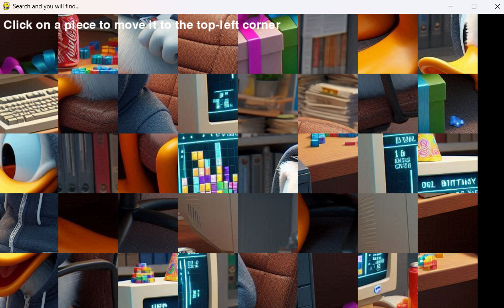

We could try to solve it and we might get the final flag, but instead lets do some further analysis.

To start of lets try to analyze if there are any strings or hidden parts that can be found before trying to decompile it using a program such as "IDA Pro". Running the `strings` command on the executable show us that the final strings found to be that of `python312.dll`, meaning this could be a python program. If we search for strings again and search for `pyinstaller` we get a match:

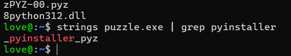

This indicates the program has been compiled using pyinstaller. Since it is possible to decompile using a simple script, there is no need open it in a more advanced decompiler.

Running the [following](https://github.com/extremecoders-re/pyinstxtractor) script, `pyinstxtractor.py` on the executable successfully identifies it as a python program and extracts the source files:

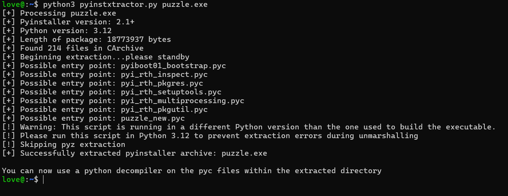

Lets open the extracted source inside a more advanced editor such as Vs Code. Among the source files we see mostly standard files related to various python libraries, the one standing out is `puzzle_new.pyc`. This is most likely the games main entry point.

If we open the files with out decompiling it we can still get some information. We can see a bunch of function calls along with a large base64 encoded image:

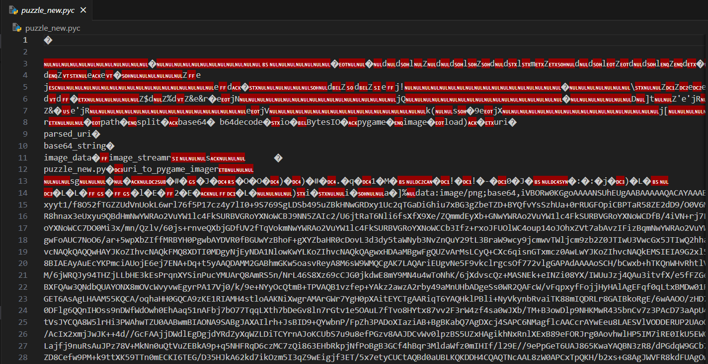

Since the program was compiled using Python 3.12, the known CLI tools to decompile .pyc files are not gonna work. There is a site (https://pylingual.io/) that allows for decompiling, but instead lets see if we can decode this string and see what the image is.

Decoding it and then rendering the results gives us what appears to be the image in the executable before it gets split:

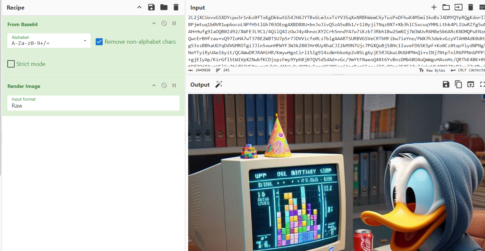

We will save it incase it contains any hints.

At this point, I had no clue on what to do, since all my assumptions did not result in anything. Decompiling the `.pyc` file gave nothing except in how to program worked, showing that nothing happens if you complete the puzzle. The other source files did not contain anything of interest either. The image itself did not give any result when analyzing it by looking for hidden files inside of it, strings of interest and changing color coding.

In a final desperate attempt lets look at the image in a standard image viewer incase there was something that was overlooked. There should be nothing since the image is obviously AI generated..

When zooming in on the computer screen to see if there was a hint there, since it shows a Tetris like game and an earlier flag was "RHODE_ISLAND_Z" there might be a clue here. Thats when I noticed there was something on the books next to the computer, text. This was the ninth and final flag, `CTF[HAPPY BIRTHDAY]`:

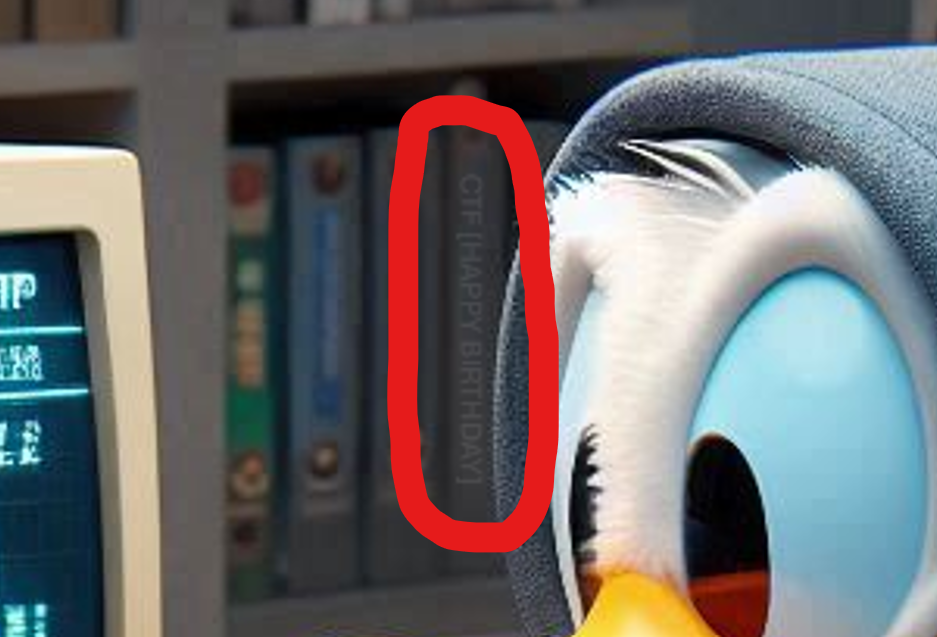

The program did not lie when it said "Search and you will find...", the flag was right there.
